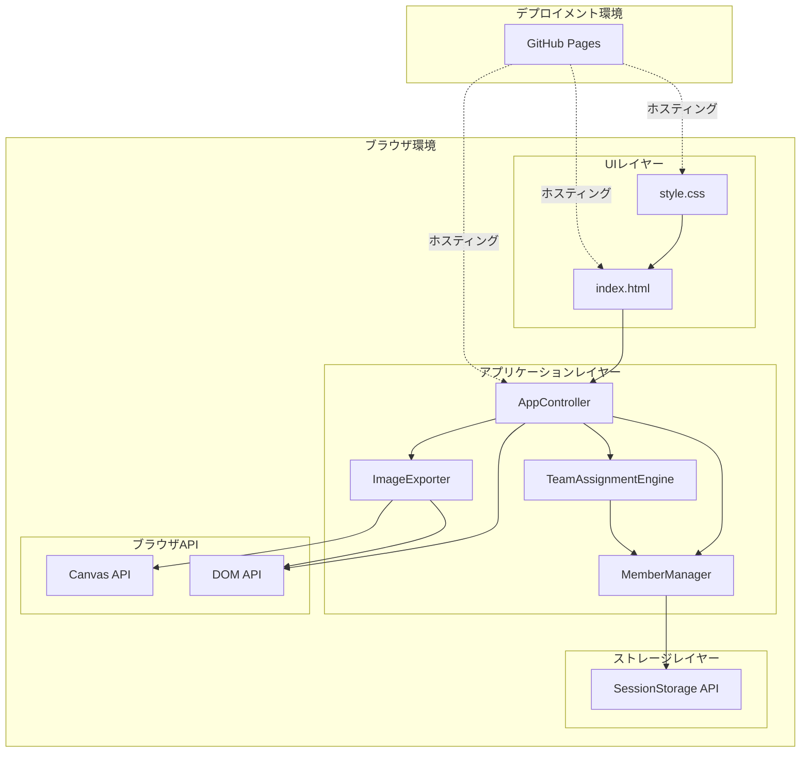
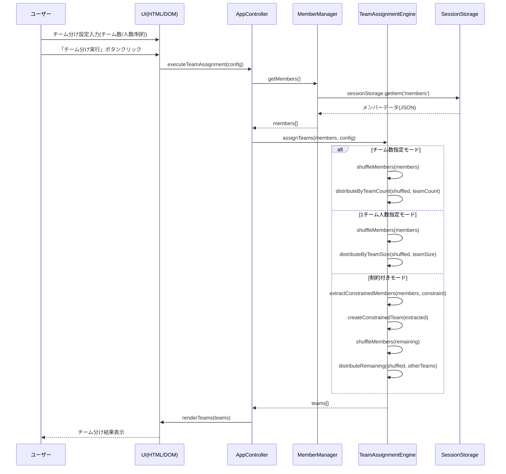
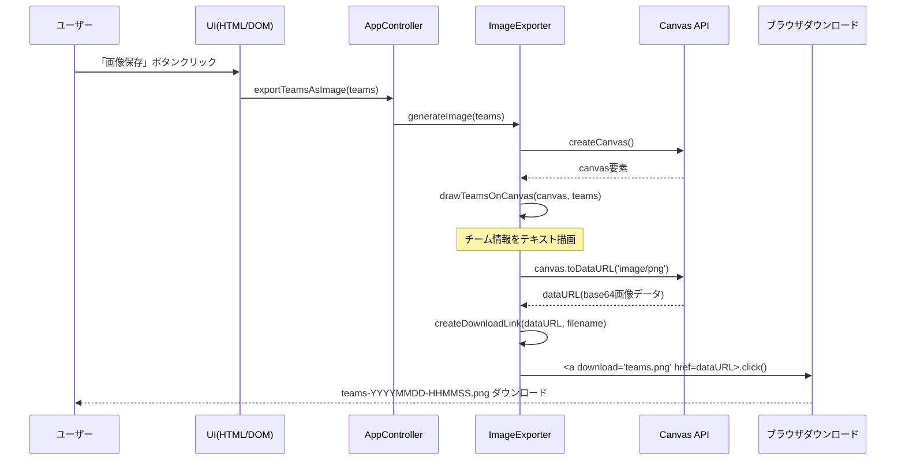

# 設計ドキュメント

## 概要

このプロジェクトは、NAiS プロジェクトチーム向けのランダムチーム分け Web アプリケーションを提供します。ユーザーはメンバーリストを管理し、チーム数または 1 チームの人数を指定してワンクリックでチーム分けを実行でき、結果を画像として保存可能です。

**目的**: プロジェクトチームのユーザーが、制約条件付きランダムチーム分けをワンクリックで実行し、結果を即座に可視化・共有できる環境を提供する。

**ユーザー**: NAiS プロジェクトチームメンバーがチーム編成、ゲーム、ワークショップなどでの迅速なグループ分けに活用する。

**影響**: GitHub Pages 上で無料ホスティングされる静的 Web アプリケーションとして、サーバー不要・アカウント不要で即座に利用可能な環境を構築する。

### ゴール

- メンバー管理(初期データ 10 人、追加・編集・削除対応)を直感的に操作可能にする
- チーム数指定/1 チーム人数指定/制約付き分けの 3 パターンをサポートする
- Fisher-Yates アルゴリズムによる均等分散ランダムチーム分けを実装する
- Canvas API を使用した画像保存機能を提供する
- GitHub Pages で即座にデプロイ可能な静的 HTML/CSS/JS 構成を実現する

### 非ゴール

- バックエンドサーバーやデータベースの構築(完全クライアントサイド)
- ユーザーアカウント管理や認証機能
- チーム分け履歴の永続化(セッション終了後はデータ削除)
- モバイルアプリ化(Web アプリのみ)
- リアルタイム同期や複数ユーザー協調編集

## アーキテクチャ

### アーキテクチャパターンと境界マップ



**アーキテクチャ統合**:

- **選定パターン**: MVC 風のシンプルな 3 層構造(UI・アプリケーション・ストレージ)
- **ドメイン/機能境界**:
  - UI レイヤー: ユーザーインタラクション(HTML/CSS)
  - アプリケーションレイヤー: ビジネスロジック(メンバー管理、チーム分けアルゴリズム、画像生成)
  - ストレージレイヤー: セッション状態管理
- **既存パターンの保持**: 新規プロジェクトのため該当なし
- **新規コンポーネントの根拠**:
  - `AppController`: UI 操作とロジック層の橋渡し
  - `MemberManager`: メンバー CRUD 操作の責務分離
  - `TeamAssignmentEngine`: チーム分けロジックの独立化
  - `ImageExporter`: 画像生成機能の独立化
- **ステアリング準拠**: フレームワークレス、依存ゼロのシンプル構成

### 技術スタック

| レイヤー       | 選択技術 / バージョン     | 役割                     | 備考                                     |
| -------------- | ------------------------- | ------------------------ | ---------------------------------------- |
| Frontend       | HTML5                     | 構造定義                 | セマンティック HTML 使用                 |
| Frontend       | CSS3                      | スタイル定義             | Flexbox/Grid、CSS カスタムプロパティ     |
| Frontend       | Vanilla JavaScript (ES6+) | アプリケーションロジック | フレームワーク不使用、モダンブラウザ対応 |
| Data           | SessionStorage API        | セッション状態管理       | ブラウザ標準 API                         |
| Rendering      | Canvas API                | 画像生成                 | HTML5 標準、PNG/JPEG 出力                |
| Infrastructure | GitHub Pages              | 静的サイトホスティング   | 無料、HTTPS 自動付与                     |

**技術選定の根拠**:

- バニラ JavaScript 採用により、ビルドプロセス不要で GitHub Pages への直接デプロイが可能
- 依存ライブラリゼロでセキュリティリスクとメンテナンス負荷を最小化
- 全てブラウザ標準 API で実装可能(Canvas、SessionStorage、DOM)
- 詳細な比較検討は`research.md`の「Architecture Pattern Evaluation」を参照

## システムフロー

### チーム分け実行フロー



**フロー判断**: チーム分けモード(チーム数/人数/制約)は設定値に基づいて分岐、Fisher-Yates シャッフルは全モードで共通

### 画像保存フロー



**フロー判断**: PNG 形式を採用(テキスト視認性優先)、ファイル名はタイムスタンプ付き

## 要件トレーサビリティ

| 要件                   | 概要                 | コンポーネント                | インターフェース      | フロー         |
| ---------------------- | -------------------- | ----------------------------- | --------------------- | -------------- |
| 1.1, 1.2               | 初期メンバー自動表示 | MemberManager                 | MemberService         | -              |
| 1.3, 1.4, 1.5          | メンバー CRUD        | MemberManager                 | MemberService         | -              |
| 2.1, 2.2, 2.3, 2.4     | チーム数指定分け     | TeamAssignmentEngine          | TeamAssignmentService | チーム分け実行 |
| 3.1, 3.2, 3.3, 3.4     | 1 チーム人数指定分け | TeamAssignmentEngine          | TeamAssignmentService | チーム分け実行 |
| 4.1, 4.2, 4.3, 4.4     | 制約付きチーム分け   | TeamAssignmentEngine          | TeamAssignmentService | チーム分け実行 |
| 5.1, 5.2, 5.3, 5.4     | 結果表示             | AppController, UI             | DOM API               | チーム分け実行 |
| 6.1, 6.2, 6.3          | 再抽選               | AppController                 | -                     | チーム分け実行 |
| 7.1, 7.2, 7.3, 7.4     | 画像保存             | ImageExporter                 | ImageExportService    | 画像保存       |
| 8.1, 8.2, 8.3, 8.4     | UI/UX デザイン       | UI(HTML/CSS)                  | -                     | -              |
| 9.1, 9.2, 9.3, 9.4     | デプロイメント       | GitHub Pages                  | -                     | -              |
| 10.1, 10.2, 10.3, 10.4 | データ管理           | MemberManager, SessionStorage | StorageService        | -              |

## コンポーネントとインターフェース

### コンポーネント概要

| コンポーネント       | ドメイン/レイヤー  | 意図                      | 要件カバレッジ | 主要依存関係(優先度)                                           | コントラクト   |
| -------------------- | ------------------ | ------------------------- | -------------- | -------------------------------------------------------------- | -------------- |
| AppController        | アプリケーション   | UI 操作とロジックの橋渡し | 5, 6           | MemberManager(P0), TeamAssignmentEngine(P0), ImageExporter(P1) | Service        |
| MemberManager        | アプリケーション   | メンバー CRUD 管理        | 1, 10          | SessionStorage API(P0)                                         | Service, State |
| TeamAssignmentEngine | アプリケーション   | チーム分けロジック        | 2, 3, 4        | MemberManager(P0)                                              | Service        |
| ImageExporter        | アプリケーション   | 画像生成・エクスポート    | 7              | Canvas API(P0), DOM API(P1)                                    | Service        |
| UI Components        | プレゼンテーション | ユーザーインターフェース  | 8              | AppController(P0)                                              | -              |

### アプリケーションレイヤー

#### AppController

| フィールド   | 詳細                                     |
| ------------ | ---------------------------------------- |
| Intent       | ユーザー操作の受付とコンポーネント間調整 |
| Requirements | 5.1, 5.2, 5.3, 5.4, 6.1, 6.2, 6.3        |

**責務と制約**

- UI 操作(ボタンクリック、フォーム送信)をキャプチャし、適切なロジック層へ委譲
- チーム分け結果を DOM に反映
- 再抽選時に前回の設定を保持し、再実行を調整
- トランザクションスコープ: 単一ユーザーセッション内

**依存関係**

- Outbound: MemberManager - メンバーデータ取得 (P0)
- Outbound: TeamAssignmentEngine - チーム分け実行 (P0)
- Outbound: ImageExporter - 画像生成 (P1)
- External: DOM API - UI 更新 (P0)

**コントラクト**: Service [x] / API [ ] / Event [ ] / Batch [ ] / State [ ]

##### Service Interface

```typescript
interface AppController {
  /**
   * アプリケーション初期化
   * - DOM要素の参照取得
   * - イベントリスナー登録
   * - 初期メンバーロード
   */
  init(): void;

  /**
   * チーム分け実行
   * @param config チーム分け設定
   * @returns 成功: チーム配列, 失敗: エラーメッセージ
   */
  executeTeamAssignment(config: TeamAssignmentConfig): Result<Team[], string>;

  /**
   * 再抽選実行
   * - 前回の設定で再度チーム分け実行
   */
  reExecuteTeamAssignment(): Result<Team[], string>;

  /**
   * 画像保存実行
   * @param teams チーム配列
   */
  exportImage(teams: Team[]): Result<void, string>;
}

type TeamAssignmentConfig =
  | { mode: "teamCount"; teamCount: number }
  | { mode: "teamSize"; teamSize: number }
  | {
      mode: "constraint";
      constraint: MemberConstraint;
      otherTeamCount: number;
    };

type MemberConstraint = {
  type: "hiragana" | "katakana";
  count: number;
};
```

**事前条件**:

- `init()`が実行され、DOM 要素が正常に取得されている
- `executeTeamAssignment()`実行時、少なくとも 1 人以上のメンバーが存在する

**事後条件**:

- チーム分け成功時、UI 上にチーム結果が表示される
- エラー時、ユーザーにエラーメッセージが表示される

**不変条件**:

- チーム分け設定は常に有効な値(正の整数、有効な制約)である

#### MemberManager

| フィールド   | 詳細                                      |
| ------------ | ----------------------------------------- |
| Intent       | メンバーデータの CRUD 操作と永続化管理    |
| Requirements | 1.1, 1.2, 1.3, 1.4, 1.5, 10.1, 10.2, 10.3 |

**責務と制約**

- メンバーリスト(名前、種別)の追加・編集・削除
- 初期メンバー 10 人(ひらがな 5 人、カタカナ 5 人)の初期化
- SessionStorage を使用したセッション内データ永続化
- データ整合性: 重複チェック、空文字列禁止
- トランザクションスコープ: セッション単位(ブラウザ閉鎖で削除)

**依存関係**

- External: SessionStorage API - データ永続化 (P0)

**コントラクト**: Service [x] / API [ ] / Event [ ] / Batch [ ] / State [x]

##### Service Interface

```typescript
interface MemberManager {
  /**
   * 初期メンバーをロード(SessionStorageから取得または初期化)
   */
  initializeMembers(): void;

  /**
   * 全メンバーを取得
   */
  getMembers(): Member[];

  /**
   * メンバーを追加
   * @param name メンバー名
   * @param type メンバー種別
   * @returns 成功: 追加されたメンバー, 失敗: エラーメッセージ
   */
  addMember(name: string, type: MemberType): Result<Member, string>;

  /**
   * メンバーを更新
   * @param id メンバーID
   * @param name 新しいメンバー名
   * @returns 成功: 更新されたメンバー, 失敗: エラーメッセージ
   */
  updateMember(id: string, name: string): Result<Member, string>;

  /**
   * メンバーを削除
   * @param id メンバーID
   * @returns 成功: true, 失敗: エラーメッセージ
   */
  deleteMember(id: string): Result<boolean, string>;
}

type Member = {
  id: string; // UUID
  name: string; // 1文字以上必須
  type: MemberType; // 'hiragana' | 'katakana'
};

type MemberType = "hiragana" | "katakana";

// Result型: Rust風のResult型でエラーハンドリング
type Result<T, E> = { ok: true; value: T } | { ok: false; error: E };
```

**事前条件**:

- `initializeMembers()`が最初に呼ばれる
- `addMember()`/`updateMember()`では`name`が空文字列でない

**事後条件**:

- CRUD 操作後、SessionStorage が最新状態に同期される
- `getMembers()`は常に最新のメンバーリストを返す

**不変条件**:

- メンバー ID は UUID 形式で一意
- メンバー名は常に 1 文字以上
- メンバー種別は'hiragana'または'katakana'のみ

##### State Interface

```typescript
// SessionStorageキー: 'team-assignment-members'
// 保存形式: JSON.stringify(Member[])
type StoredMembers = Member[];
```

#### TeamAssignmentEngine

| フィールド   | 詳細                                                       |
| ------------ | ---------------------------------------------------------- |
| Intent       | チーム分けアルゴリズムの実行                               |
| Requirements | 2.1, 2.2, 2.3, 2.4, 3.1, 3.2, 3.3, 3.4, 4.1, 4.2, 4.3, 4.4 |

**責務と制約**

- Fisher-Yates アルゴリズムによるメンバーシャッフル
- チーム数指定モード: メンバーを指定チーム数に均等分配(余りはランダム配分)
- 1 チーム人数指定モード: 指定人数ごとにチーム作成(余りは独立チーム)
- 制約付きモード: ひらがな/カタカナのみのチーム作成後、残りを分配
- トランザクションスコープ: 単一チーム分け操作

**依存関係**

- Inbound: AppController - チーム分け実行要求 (P0)
- Inbound: MemberManager - メンバーデータ取得 (P0)

**コントラクト**: Service [x] / API [ ] / Event [ ] / Batch [ ] / State [ ]

##### Service Interface

```typescript
interface TeamAssignmentEngine {
  /**
   * チーム分けを実行
   * @param members メンバー配列
   * @param config チーム分け設定
   * @returns 成功: チーム配列, 失敗: エラーメッセージ
   */
  assignTeams(
    members: Member[],
    config: TeamAssignmentConfig
  ): Result<Team[], string>;
}

type Team = {
  id: string; // チームID(自動生成)
  name: string; // チーム名(例: "チーム1", "チーム2")
  members: Member[]; // チームメンバー配列
};
```

**内部メソッド(非公開)**:

```typescript
/**
 * Fisher-Yatesアルゴリズムによるシャッフル
 * @param array 配列
 * @returns シャッフルされた新しい配列
 */
function shuffle<T>(array: T[]): T[];

/**
 * チーム数指定による分配
 * @param members シャッフルされたメンバー配列
 * @param teamCount チーム数
 * @returns チーム配列
 */
function distributeByTeamCount(members: Member[], teamCount: number): Team[];

/**
 * 1チーム人数指定による分配
 * @param members シャッフルされたメンバー配列
 * @param teamSize 1チームの人数
 * @returns チーム配列
 */
function distributeByTeamSize(members: Member[], teamSize: number): Team[];

/**
 * 制約付きチーム分け
 * @param members 全メンバー配列
 * @param constraint 制約条件
 * @param otherTeamCount 残りのチーム数
 * @returns チーム配列
 */
function assignWithConstraint(
  members: Member[],
  constraint: MemberConstraint,
  otherTeamCount: number
): Team[];
```

**事前条件**:

- `members`が少なくとも 1 人以上
- `config.teamCount`が 1 以上(チーム数モード)
- `config.teamSize`が 1 以上(人数モード)
- `config.constraint.count`が 0 以上で、該当メンバー数以下(制約モード)

**事後条件**:

- 全メンバーがいずれかのチームに割り当てられる
- チーム数は設定に従う(端数処理含む)
- シャッフルは毎回異なる結果を生成(疑似乱数)

**不変条件**:

- メンバーは重複してチームに所属しない
- 全メンバーの合計数は不変

#### ImageExporter

| フィールド   | 詳細                                       |
| ------------ | ------------------------------------------ |
| Intent       | チーム分け結果を画像に変換してダウンロード |
| Requirements | 7.1, 7.2, 7.3, 7.4                         |

**責務と制約**

- Canvas API を使用してチーム情報を描画
- PNG 形式で画像データ URL 生成
- ブラウザのダウンロード機能でローカル保存
- ファイル名: `teams-YYYYMMDD-HHMMSS.png`
- トランザクションスコープ: 単一画像生成操作

**依存関係**

- External: Canvas API - 画像描画・エクスポート (P0)
- External: DOM API - ダウンロードトリガー (P1)

**コントラクト**: Service [x] / API [ ] / Event [ ] / Batch [ ] / State [ ]

##### Service Interface

```typescript
interface ImageExporter {
  /**
   * チーム結果を画像としてエクスポート
   * @param teams チーム配列
   * @returns 成功: void, 失敗: エラーメッセージ
   */
  exportAsImage(teams: Team[]): Result<void, string>;
}
```

**内部メソッド(非公開)**:

```typescript
/**
 * Canvas要素を作成し、チーム情報を描画
 * @param teams チーム配列
 * @returns Canvas要素
 */
function createCanvas(teams: Team[]): HTMLCanvasElement;

/**
 * Canvas上にチーム情報を描画
 * @param ctx Canvas 2Dコンテキスト
 * @param teams チーム配列
 */
function drawTeams(ctx: CanvasRenderingContext2D, teams: Team[]): void;

/**
 * CanvasをPNG Data URLに変換
 * @param canvas Canvas要素
 * @returns Data URL文字列
 */
function canvasToDataURL(canvas: HTMLCanvasElement): string;

/**
 * Data URLからダウンロードを実行
 * @param dataURL Data URL文字列
 * @param filename ファイル名
 */
function triggerDownload(dataURL: string, filename: string): void;
```

**事前条件**:

- `teams`が少なくとも 1 チーム以上
- Canvas API がブラウザでサポートされている

**事後条件**:

- ユーザーのダウンロードフォルダに画像ファイルが保存される
- 画像には全チームとメンバー名が視認可能に表示される

**不変条件**:

- 画像フォーマットは PNG
- ファイル名はタイムスタンプ付き

### プレゼンテーションレイヤー

#### UI Components

| フィールド   | 詳細                           |
| ------------ | ------------------------------ |
| Intent       | ユーザーインターフェースの提供 |
| Requirements | 8.1, 8.2, 8.3, 8.4             |

**主要 UI コンポーネント**:

- **MemberListSection**: メンバーリスト表示・編集(追加/編集/削除ボタン)
- **SettingsSection**: チーム分け設定フォーム(モード選択、パラメータ入力)
- **TeamResultSection**: チーム分け結果表示(リスト/カード切り替え)
- **ActionButtons**: 実行/再抽選/画像保存ボタン

**実装注**:

- HTML セマンティック要素使用(`<section>`, `<button>`, `<form>`)
- CSS カスタムプロパティで色テーマ管理(`--primary-color: #2196F3`)
- Flexbox/Grid でレスポンシブレイアウト
- アニメーションなし(即座表示)

## データモデル

### Member (メンバー)

```typescript
type Member = {
  id: string; // UUID v4形式の一意識別子
  name: string; // メンバー名(1文字以上必須)
  type: MemberType; // メンバー種別
};

type MemberType = "hiragana" | "katakana";
```

**ライフサイクル**:

- 作成: `MemberManager.addMember()`で生成、UUID とタイムスタンプ割り当て
- 更新: `MemberManager.updateMember()`で名前変更可能
- 削除: `MemberManager.deleteMember()`で論理削除(配列から除外)
- 永続化: SessionStorage に保存(セッション終了で消去)

**初期データ**:

```json
[
  { "id": "uuid-1", "name": "あ", "type": "hiragana" },
  { "id": "uuid-2", "name": "い", "type": "hiragana" },
  { "id": "uuid-3", "name": "う", "type": "hiragana" },
  { "id": "uuid-4", "name": "え", "type": "hiragana" },
  { "id": "uuid-5", "name": "お", "type": "hiragana" },
  { "id": "uuid-6", "name": "ア", "type": "katakana" },
  { "id": "uuid-7", "name": "イ", "type": "katakana" },
  { "id": "uuid-8", "name": "ウ", "type": "katakana" },
  { "id": "uuid-9", "name": "エ", "type": "katakana" },
  { "id": "uuid-10", "name": "オ", "type": "katakana" }
]
```

### Team (チーム)

```typescript
type Team = {
  id: string; // チームID(生成時にUUID割り当て)
  name: string; // チーム名(例: "チーム1", "チームA")
  members: Member[]; // チームに所属するメンバー配列
};
```

**ライフサイクル**:

- 作成: `TeamAssignmentEngine.assignTeams()`で生成
- 永続化: なし(メモリ上のみ、チーム分け実行のたびに再生成)
- 表示: UI 上でリスト/カード形式で表示
- エクスポート: `ImageExporter.exportAsImage()`で画像化

### TeamAssignmentConfig (チーム分け設定)

```typescript
type TeamAssignmentConfig =
  | { mode: "teamCount"; teamCount: number }
  | { mode: "teamSize"; teamSize: number }
  | {
      mode: "constraint";
      constraint: MemberConstraint;
      otherTeamCount: number;
    };

type MemberConstraint = {
  type: "hiragana" | "katakana";
  count: number;
};
```

**バリデーション**:

- `teamCount`: 1 以上の整数、メンバー数以下
- `teamSize`: 1 以上の整数、メンバー数以下
- `constraint.count`: 0 以上の整数、該当メンバー数以下
- `otherTeamCount`: 1 以上の整数

## エラーハンドリング

### エラー分類と処理方針

| エラータイプ           | 例                                       | 処理方法                                     | ユーザー通知                                 |
| ---------------------- | ---------------------------------------- | -------------------------------------------- | -------------------------------------------- |
| バリデーションエラー   | 空のメンバー名、不正なチーム数           | 入力時点で UI バリデーション、送信前チェック | フォーム下にエラーメッセージ表示(赤色)       |
| ビジネスロジックエラー | メンバー数不足、制約条件不成立           | Result 型でエラー返却、操作中止              | モーダルダイアログまたはトースト通知         |
| ブラウザ API 失敗      | SessionStorage 制限超過、Canvas 描画失敗 | try-catch でキャッチ、フォールバック処理     | エラーメッセージとリトライボタン表示         |
| 予期しないエラー       | JavaScript 例外                          | グローバルエラーハンドラで捕捉、ログ記録     | 「予期しないエラーが発生しました」メッセージ |

### Result 型によるエラーハンドリング

```typescript
type Result<T, E> = { ok: true; value: T } | { ok: false; error: E };

// 使用例
const result = memberManager.addMember("太郎", "hiragana");
if (result.ok) {
  console.log("追加成功:", result.value);
} else {
  console.error("追加失敗:", result.error);
  showErrorMessage(result.error);
}
```

**エラーメッセージ例**:

- `"メンバー名は1文字以上で入力してください"`
- `"チーム数は1以上の整数を指定してください"`
- `"ひらがなメンバーが不足しています(必要: 3人、現在: 2人)"`
- `"画像の生成に失敗しました。もう一度お試しください"`

## セキュリティ

### セキュリティ要件

| 要件       | 対策                             | 実装方法                                                    |
| ---------- | -------------------------------- | ----------------------------------------------------------- |
| XSS 対策   | ユーザー入力のサニタイゼーション | `textContent`使用(HTML エスケープ不要)、`innerHTML`使用禁止 |
| データ保護 | 個人情報非保存                   | サーバー送信なし、SessionStorage のみ使用                   |
| HTTPS 通信 | 暗号化通信                       | GitHub Pages が自動で HTTPS 提供                            |
| CORS       | 外部リソース未使用               | 全リソース同一オリジン(GitHub Pages)                        |

**注意事項**:

- サーバーサイド処理がないため、認証・認可は不要
- 個人情報を扱わないため、GDPR 等の対応不要
- `Math.random()`は暗号学的に安全ではないが、ゲーム用途には十分

## パフォーマンス

### パフォーマンス目標

| メトリクス         | 目標値                     | 測定方法                   |
| ------------------ | -------------------------- | -------------------------- |
| 初期ロード時間     | < 1 秒                     | Chrome DevTools Lighthouse |
| チーム分け実行時間 | < 100ms(100 人以下)        | `performance.now()`計測    |
| 画像生成時間       | < 500ms                    | `performance.now()`計測    |
| ファイルサイズ     | HTML+CSS+JS < 50KB(非圧縮) | ファイルサイズ確認         |

### 最適化戦略

- **バニラ JavaScript 使用**: フレームワークオーバーヘッドなし
- **外部依存ゼロ**: ネットワークリクエストなし(初回ロードのみ)
- **Fisher-Yates アルゴリズム**: O(n)時間計算量
- **Canvas 描画最適化**: 一度に描画、再描画なし
- **CSS アニメーションなし**: GPU 負荷最小化

## デプロイメント

### GitHub Pages デプロイ手順

1. **リポジトリ構成**:

   ```
   /
   ├── index.html
   ├── style.css
   ├── app.js
   └── README.md
   ```

2. **GitHub Pages 設定**:

   - リポジトリ設定 > Pages > Source: `main`ブランチ / `/(root)`
   - 自動ビルド・デプロイ(数分で反映)

3. **アクセス URL**:
   - `https://<username>.github.io/<repository>/`

### 環境要件

- **ブラウザ**: モダンブラウザ(Chrome 90+, Firefox 88+, Safari 14+, Edge 90+)
- **JavaScript**: ES6+サポート必須
- **Canvas API**: HTML5 Canvas サポート必須
- **SessionStorage**: ブラウザ標準 API サポート必須

### 制約事項

- **オフライン動作不可**: 初回ロードにインターネット接続必要(キャッシュ後はオフライン可能だが、要件で不要と定義)
- **IE11 非対応**: モダンブラウザのみ対応
- **サーバーサイド処理なし**: 全てクライアントサイドで完結

## テスト戦略

### テストレベル

| レベル     | 対象                 | 方法        | ツール            |
| ---------- | -------------------- | ----------- | ----------------- |
| 単体テスト | 各コンポーネント関数 | Jest/Vitest | Vitest(任意)      |
| 統合テスト | コンポーネント間連携 | 手動テスト  | ブラウザ DevTools |
| E2E テスト | ユーザーフロー全体   | 手動テスト  | 実ブラウザ        |
| UI テスト  | レスポンシブデザイン | 手動テスト  | Chrome DevTools   |

### 主要テストケース

1. **メンバー管理**:

   - 初期メンバー 10 人表示
   - メンバー追加(名前入力)
   - メンバー編集(名前変更)
   - メンバー削除
   - 空文字列入力でバリデーションエラー

2. **チーム分け**:

   - チーム数指定(3 チーム、端数あり/なし)
   - 1 チーム人数指定(4 人ずつ、端数あり/なし)
   - 制約付き(ひらがな 3 人チーム作成、残り分配)
   - 再抽選で異なる結果

3. **画像保存**:

   - PNG 画像ダウンロード
   - 画像内にチーム情報表示
   - ファイル名にタイムスタンプ

4. **UI/UX**:
   - レスポンシブデザイン(モバイル/タブレット/デスクトップ)
   - 青色基調のカラーテーマ
   - ワンクリック操作

## 運用・保守

### モニタリング

- **不要**: サーバーサイドなし、ログ収集なし
- **ユーザーフィードバック**: GitHub Issues で受付

### 更新手順

1. ローカルでコード変更
2. `main`ブランチにコミット&プッシュ
3. GitHub Pages が自動デプロイ(数分)

### バックアップ

- **不要**: サーバーサイドデータなし
- **リポジトリバックアップ**: GitHub が自動管理

## 今後の拡張可能性

### 将来的な機能候補

- **履歴保存**: LocalStorage を使用したチーム分け履歴の永続化
- **CSV/Excel インポート**: メンバーリストの一括インポート
- **PDF 出力**: 画像だけでなく PDF 形式でのエクスポート
- **カスタムテーマ**: カラーテーマのカスタマイズ機能
- **チーム名カスタマイズ**: "チーム 1"ではなく任意の名前設定

### アーキテクチャ拡張時の検討事項

- **フレームワーク導入**: React/Vue への移行(コンポーネント再利用性向上)
- **状態管理ライブラリ**: Zustand/Redux の導入(複雑化時)
- **テストフレームワーク**: Vitest/Cypress の導入(品質保証強化)
